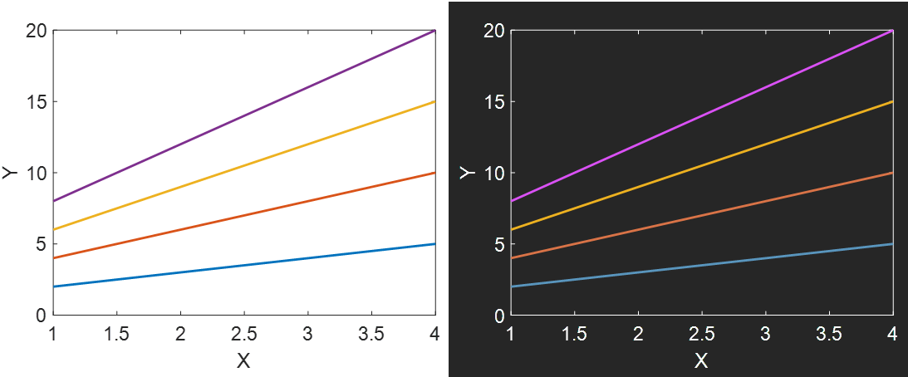

# plot_darkmode
convert a regular matlab plot to fit a dark mode theme background

The function generates from a Matlab plot figure a version that can be copied to a dark mode theme presentation or website. 
It replaces the default texts and box colors to a user input color (default is white), make the plot area transparent to
 accept the dark background below it. 
The function also transform the graphic colors that are not appropriate (low contrast) to a version that
is dark theme legible using a desaturation and brightness approach.

Preparing this function I was inspired by https://material.io/design/color/dark-theme.html

How to use the function:
 generate or import a Matlab figure and run the function:

       plot(bsxfun(@times,[1:4],[2:5]'));xlabel('X');ylabel('Y');
       plot_darkmode

  next copy the figure from the clipboard using Edit>Copy Figure and  paste it on top of the dark background theme, for example in
  PowerPoint. Make sure that in the Copy Option, the  Transparent Background is enabled
  
  
